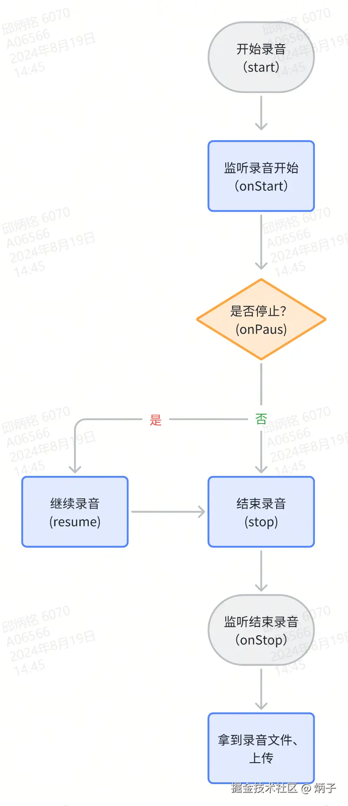
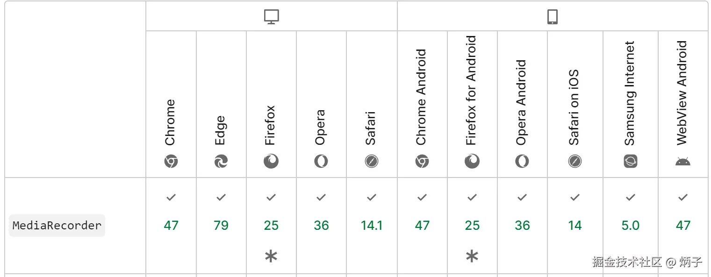

# soundRecord

小程序、H5 的录音开源项目

# 引言

最近的项目开发中做了一个微信小程序录音的功能，遇到了一些问题，是如何解决的？

本文会从两种解决方案（微信小程序录音 API/H5 录音嵌入 webview 中），从优点、难点、缺陷、实现等进行讲解，并附有代码。

# 方案一

## `RecorderManager` 微信小程序 API

> 创建全局的唯一录音器，可以在当前页面或者小程序内其他页面操作，不影响录音运行。

### 缺陷

> 1.  **熄屏**、**锁屏后**会停止录音
> 2.  **切换 APP** 也会停止录音
> 3.  小程序进入后台并被「挂起」后，如果很长时间（目前是 30 分钟）都未再次进入前台，小程序会被销毁；也会停止录音

### 难点

> 1.  录音切换页面、小程序后台运行、微信后台运行，会暂停录音，如何保持联系
> 2.  录音时长最大支持 10 分钟，解决方法

### 实现

> 创建全局的录音管理器，通过`start`开始录音，`stop`结束录音；并在`onStop`监听结束录音获取到录音文件并做处理。

#### API 使用

> - `RecorderManager` 全局唯一的录音管理器
> - `RecorderManager.start` 开始录音
> - `RecorderManager.stop` 停止录音
> - `RecorderManager.resume` 继续录音
> - `RecorderManager.onPause` 监听录音暂停；如非手动暂停，可在此继续录音
> - `RecorderManager.onStop` 监听录音结束，会返回录音的临时文件 `tempFilePath`

#### 录音流程

### 代码

/miniprogram/hooks/useRecord.js

# 方案二

## `MediaRecorder` MediaStream Recording API

> - 通过开发录音的 H5 并嵌入 webview 可以解决**熄屏**、**锁屏**、**切换 APP**的录音暂停问题。
> - 不仅可以解决上述小程序的缺陷；而且还可以解决不同端的录音器 API 差异或没有支持录音 API。

### 缺陷

> 1.  小程序 “返回上一页” 等销毁 webview 页面的操作，录音也会被停止

### 难点

> 1.  H5 的与小程序 webview 通信
> 2.  H5 录音，拒绝授权后的引导处理

### 实现

> - 通过 MediaRecorder 实现录音的 H5 页面。
> - 需要在小程序中使用，使用 `webview` 嵌入 H5，然后通过 postMessage 进行通信。

#### 兼容性

MediaRecorder API，目前的主流浏览器都已经支持，包括微信浏览器。

#### API

> - `const stream = awwit navigator.mediaDevices.getUserMedia({ audio: true })` 打开浏览器麦克风录音
> - `new MediaRecorder(stream, { mimeTyp: 'audio/mp3', })` 创建录音器
> - `ondataavailable` 用于获取录制的媒体资源
> - `start` 开始录音
> - `stop` 结束录音

### 代码

/h5/hooks/useRecord.js

#### 注意事项

- 录音的 H5 网络协议得是 `https` 协议
- 录音最好设置最大时长；时长过大，录音文件大小会比较大，上传速度会有影响
- 嵌入到小程序中，需配置 `webview` 域名
- 与 `webview` 进行通信，在 `onMessage` 获取数据；返回的数据是多次 `postMessage` 的数据组成的**数组**。
- 在 H5 中通过 `wxjsddk` 进行操作，`postMessage` 进行数据通信，只会在**小程序后退、组件销毁、分享、复制链接后触发**。
- 更多请查看 API：<https://developers.weixin.qq.com/miniprogram/dev/component/web-view.html>
